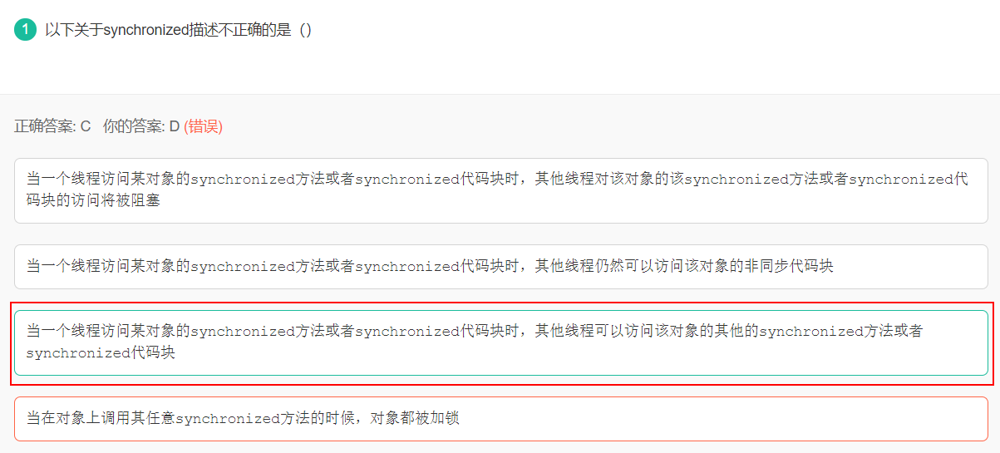

- [0 反射](#0-反射)
- [1 多线程](#1-多线程)
    - [1.1 线程安全](#11-线程安全)
    - [1.2 内部锁 synchronized](#12-内部锁-synchronized)
    - [1.3 重进入 Reentrancy](#13-重进入-reentrancy)
- [2 同步](#2-同步)
    - [2.1 非原子的 64 位操作](#21-非原子的-64-位操作)
    - [2.2 volatile 变量](#22-volatile-变量)
    - [2.3 发布和逸出](#23-发布和逸出)
    - [2.4 不可变性](#24-不可变性)
- [3 组合对象](#3-组合对象)
    - [3.1 设计线程安全的类](#31-设计线程安全的类)
- [4 构建块](#4-构建块)
    - [4.1 同步容器](#41-同步容器)
    - [4.2 并发容器](#42-并发容器)
        - [4.2.1 ConcurrentHashMap](#421-concurrenthashmap)
        - [4.2.2 CopyOnWriteArrayList](#422-copyonwritearraylist)

# 0 反射

反射：主要是指程序可以访问，检测和修改它本身状态或行为的一种能力，并能根据自身行为的状态和结果，调整或修改应用所描述行为的状态和相关的语义。

反射机制主要提供以下功能：

1. 在运行时判断任意一个对象所属的类；

2. 在运行时构造任意一个类的对象；

3. 在运行时判断任意一个类所具有的成员变量和方法；

4. 在运行时调用任意一个对象的方法；

5. 生成动态代理。

与反射有关的类：

```java
// 类
java.lang.Class;
// 构造器
java.lang.reflect.Constructor;
// 属性
java.lang.reflect.Field;
// 方法
java.lang.reflect.Method;
// 访问修饰符
java.lang.reflect.Modifier;
```

**优点：** 
（1）能够运行时动态获取类的实例，大大提高系统的灵活性和扩展性。 
（2）与Java动态编译相结合，可以实现无比强大的功能 
**缺点：** 
（1）使用反射的性能较低 
（2）使用反射相对来说不安全 
（3）破坏了类的封装性，可以通过反射获取这个类的私有方法和属性 


# 1 多线程

## 1.1 线程安全

编写线程安全的代码，本质上就是管理对对象的状态的访问，而且这些状态通常都是共享的、可变的。

一个对象的**状态**就是它的数据，存储在状态变量中。**共享**就是一个变量可以被多个线程访问。可变是指变量的值在其生命周期内是可以被**改变**的。

按照线程安全的安全程度分：

1. 不可变：final，java.lang.String的对象是不可变对象
2. 绝对线程安全：不论何种环境下，不需要做任何额外同步措施
3. 相对线程安全：使用额外的同步手段保证调用的正确性
4. 线程兼容：对象本身不是线程安全的，可以通过调用段使用同步手段来保证对象安全
5. 线程对立：不管采用哪种方式，都不能并发的使用。

线程安全的定义：一个类是线程安全的，是指在被多个线程访问时，类可以持续进行正确的行为。


线程安全的类封装了任何必要的同步，因此客户不需要自己提供。

无状态对象永远是线程安全的。多数 Servlet 都可以实现为无状态的。

**原子操作**


## 1.2 内部锁 synchronized

 

```java
synchronized(lock) {
    // 代码
}
```

执行线程进入 synchronized 块之前会自动获得对象的内部锁，离开 synchronized 块时自动释放锁。获得内部锁的唯一途径是进入这个内部锁保护的同步块或方法。

内部锁是互斥锁，至多只有一个线程可以拥有内部锁。其他线程会被阻塞，直到锁被释放。

【看看题】



1.synchronzied关键字修饰static方法：该锁由该类持有，相同类只可持有一把锁。

2.synchronzied关键字修饰普通方法：该锁由类对象持有，相同对象只可持有一把锁。


(1) synchronized 修饰方法时锁定的是调用该方法的对象。它并不能使调用该方法的多个对象在执行顺序上互斥。

(2)在synchronized锁上阻塞的线程是不可中断的

(3) synchronized锁释放是自动的

(4)线程在竞争synchronized锁时是非公平的

(5)synchronized锁是读写互斥并且读读也互斥


(1)ReentrantLock 锁能实现可中断的阻塞。

(2)ReentrantLock 释放非自动需要在try-finally块中释放锁

(3)ReentrantLock 能够实现锁的公平性

(4)ReentrantReadWriteLock 分为读锁和写锁，而读锁可以同时被多个线程持有，适合于读多写少场景的并发。

## 1.3 重进入 Reentrancy


获得的对象关联的锁并不能阻止其他线程访问这个对象，只能阻止其他线程再获得相同的锁。

每个对象都有一个内部锁。 

# 2 同步

## 2.1 非原子的 64 位操作

没有被声明位 volatile 的 64 位数值变量 (double、long)，JVM 允许将64位的读写划分为两个 32 位操作。

## 2.2 volatile 变量

volatile 变量的特性：

1. 保证该变量对所有线程可见。确保变量的更新以可预见的方式告知其他的线程
2. 禁止指令重排序优化。它是共享的，对它的操作不会与其他内存操作一起被重排序
3. volatile 变量不会缓存在寄存器或者缓存在其他处理器隐藏的地方

因此，读取 volatile 变量时，总会访问由某一线程写入的最新值。

注意：volatile 语义不会保证自增操作原子化。

要使用 volatile 变量，得满足：

1. 写入变量时并不依赖变量的当前值；或者能够确保只有单一的线程修改变量的值
2. 变量不需要与其他状态变量参与不变约束
3. 访问变量时，没有其他的原因需要加锁

## 2.3 发布和逸出

发布一个对象，是使它能够被当前范围之外的代码所使用。

## 2.4 不可变性

不可变对象永远是线程安全的。

 

# 3 组合对象

## 3.1 设计线程安全的类

设计线程安全的类包括以下三要素：

1. 确定对象状态是由哪些变量构成的
2. 确定限制状态变量的不变约束
3. 制定一个管理并发访问对象状态的策略

# 4 构建块

## 4.1 同步容器

同步容器类包括：

1. Vector 和 HashTable
2. jdk 1.2 加入的 同步包装类 (wrapper)，由 Collections.synchronizedXxx 工厂方法创建

这些类通过封装它们的状态，并对每个公共方法进行同步，来实现线程安全。


会出现的问题：对于复合操作，需要额外的加锁处理。

迭代器 ConcurrentModificationException 并发修改异常

## 4.2 并发容器

jdk 5 提供了几种并发的容器类。

ConcurrentHashMap、CopyOnWriteArrayList


### 4.2.1 ConcurrentHashMap

使用 **分离锁**，它允许更深层次的共享访问。

任意数量的读线程可以并发访问；读者和写者也可以并发访问；有限数量的写线程可以并发修改。

好处：为并发访问带来更高的吞吐量，并且几乎没有损失单个线程访问的性能。

其迭代器不会抛出 ConcurrentModificationException  异常，不需要在迭代中加锁。返回的迭代器具有 **弱一致性**，可以感知 (但不保证) 在迭代器被创建后容器的修改。

### 4.2.2 CopyOnWriteArrayList

