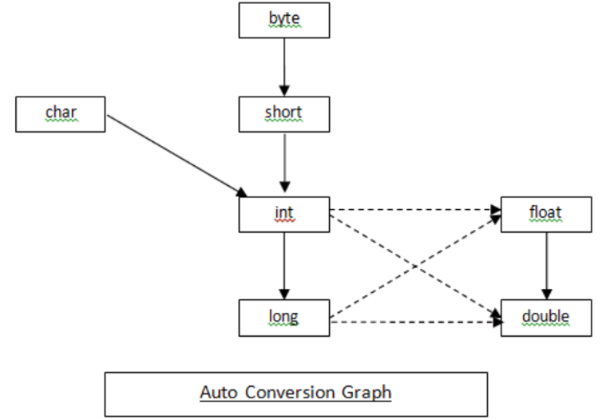
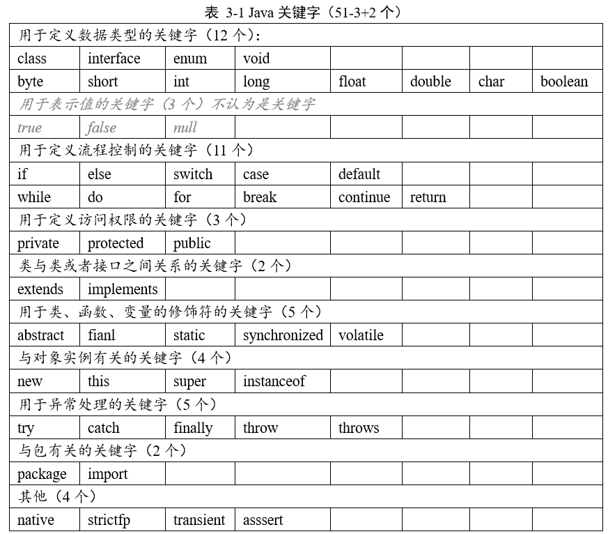
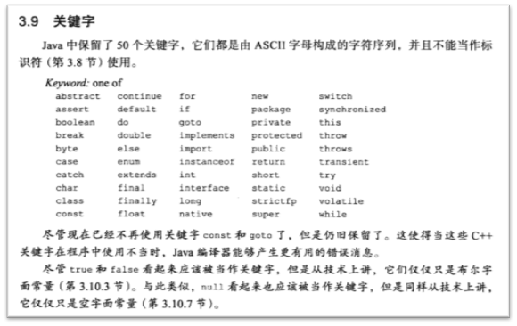
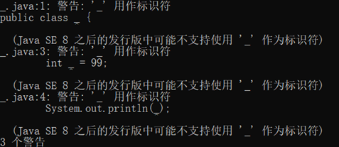
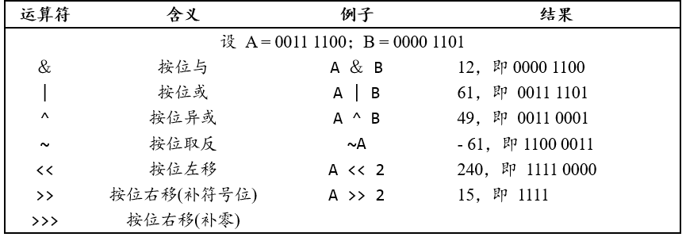
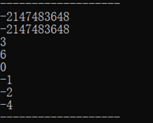
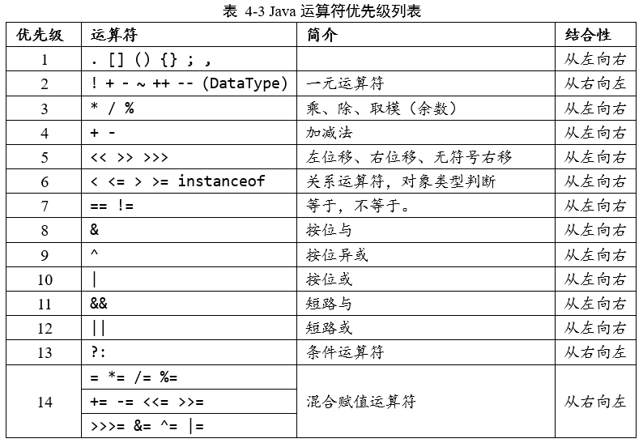
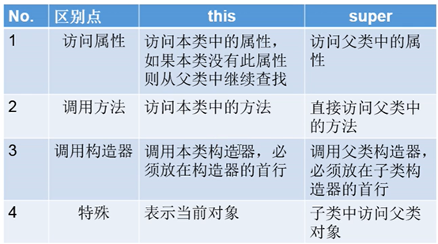

- [1 Java 简介](#1-java-简介)
    - [1.1 Java语言版本迭代](#11-java语言版本迭代)
    - [1.2 JDK JRE JVM 三者间的关系](#12-jdk-jre-jvm-三者间的关系)
    - [1.3 Hello World 程序](#13-hello-world-程序)
    - [1.4 注释](#14-注释)
- [2 变量](#2-变量)
    - [2.1 变量的声明和赋值](#21-变量的声明和赋值)
    - [2.2 Java 变量的分类](#22-java-变量的分类)
        - [2.2.1 按数据类型分](#221-按数据类型分)
        - [2.3.2 按声明位置分](#232-按声明位置分)
    - [2.3 变量间的运算](#23-变量间的运算)
        - [2.3.1 基本数据类型间的运算（不包括boolean）](#231-基本数据类型间的运算不包括boolean)
        - [2.3.2 基本数据类型和String间的运算](#232-基本数据类型和string间的运算)
- [3 标识符和关键字](#3-标识符和关键字)
    - [3.1 关键字和保留字](#31-关键字和保留字)
    - [3.2 标识符](#32-标识符)
- [4 运算符](#4-运算符)
    - [4.1 算术运算符](#41-算术运算符)
    - [4.2 赋值运算符](#42-赋值运算符)
    - [4.3 关系运算符（比较运算符）](#43-关系运算符比较运算符)
    - [4.4 逻辑运算符](#44-逻辑运算符)
    - [4.5 位运算符](#45-位运算符)
        - [4.5.1 进制](#451-进制)
        - [4.5.2 原码 反码 补码](#452-原码-反码-补码)
        - [4.5.3 位运算](#453-位运算)
    - [4.6 三元运算符](#46-三元运算符)
    - [4.7 运算符的优先级](#47-运算符的优先级)
- [5 数组](#5-数组)
- [6 面向对象编程基础](#6-面向对象编程基础)
    - [6.1 包（package与import）](#61-包package与import)
    - [6.2 访问权限修饰符](#62-访问权限修饰符)
    - [6.3 this](#63-this)
    - [6.4 super](#64-super)
    - [6.5 static](#65-static)
        - [6.5.1 static修饰变量：类变量](#651-static修饰变量类变量)
        - [6.5.2 static修饰方法：静态方法](#652-static修饰方法静态方法)
        - [6.5.3 类加载的过程](#653-类加载的过程)
    - [6.6 final](#66-final)
    - [6.7 JavaBean](#67-javabean)

# 1 Java 简介

## 1.1 Java语言版本迭代

1995年发布JDK1.0；JDK1.5开始改名为JDK5.0,以后都是6.0，7.0 …。

JavaSE（J2SE）：Java核心API + 桌面级应用开发

JavaEE（J2EE）：企业级开发（Web应用）

JavaME（J2ME）：移动端应用开发

## 1.2 JDK JRE JVM 三者间的关系

JDK = JRE + Java开发工具集

JRE = JVM + Java SE 标准类库

## 1.3 Hello World 程序

(1) **创建**：创建一个以.java结尾的文件

(2) **编辑**：

``` java  
public class HelloWorld {    
    public  static void main(String[] args) {        
        System.out.println("hello, world");    
    }  
} 
```

(3) **编译**：javac 源文件名.Java     可以生成一个或多个字节码文件（有几个类就有几个字节码文件）

(4) **运行**：java 字节码文件名（注意：不要.class拓展名）

说明：

1. 一个源文件中可以由多个类，但是只能有一个public类；

2. public类的名字必须和源文件名一样

## 1.4 注释

(1) **单行注释**：//

(2) **多行注释**：/* */

​    多行注释不能被嵌套使用

(3) **文档注释**：/** */

javadoc -d 目标路径 -author -version 源文件名.java


# 2 变量

## 2.1 变量的声明和赋值

第一种：声明变量，同时赋值

```java
// 一个变量  
int a = 1;  
// 多个变量  
int a = 1, b = 2, c = 3;  
```

第二种：先声明后赋值

```java
// 一个变量  
int a;  
a = 2;  
// 多个变量  
int a, b, c;  
a = b = c = 10;  
```

说明：

1.  变量的作用域：声明变量所在的那对大括号内；

2.  在同一个作用域内，变量命不允许重复；

3.  变量应该先声明后使用；

4.  同一个变量可以被多次赋值，后一次赋值覆盖前一次赋值。

## 2.2 Java 变量的分类

### 2.2.1 按数据类型分

(1) 整数类型：byte、short、int、long

​	Java的整数类型有固定的表数范围和字段长度，不受具体的操作系统的影响，以保证Java程序的可移植性。

​	Java整型常量默认为int类型，long类型常量必须在末尾加上“l”或者“L”。

| **类型** | **占用的存储空间** | **表数范围**             |
| -------- | ------------------ | ------------------------ |
| byte     | 1字节              | -128 ~ 127               |
| short    | 2字节              | -32768 ~ 32767           |
| int      | 4字节              | -2147483648 ~ 2147483647 |
| long     | 8字节              | -2^63  ~ 2^63-1          |

(2) 浮点类型：float、double

​	Java的浮点类型有固定的表数范围和字段长度，不受具体的操作系统的影响，以保证Java程序的可移植性。

​	Java浮点型常量默认为double类型（也可以在末尾加上“d”或者“D”），float类型常量必须在末尾加上“f”或者“F”。

​	浮点数表示形式：

​		十进制数表示法：5.12，512.0f，.512

​		科学计数表示法：5.12e2，512E2，100E-2

| **类型** | **占用的存储空间** | **表数范围**           |
| -------- | ------------------ | ---------------------- |
| float    | 4字节              | -3.403E38 ~ 3.403E38   |
| double   | 8字节              | -1.798E308 ~ 1.798E308 |

(3) 字符类型：char 

​	Java中的字符类型是占两个字节的。其表示方式有以下三种：

```java
// 单个普通字符  
char c1 = 'A';
char c2 = '中'; 
// 转义字符  
char n1 = '\n';  
// 3. Unicode值  
char n2 = '\u0056';
char c3 = 65;  
```

| 转义字符 | 意义                                | ASCII码值（十进制） |
| -------- | ----------------------------------- | ------------------- |
| \a       | 响铃(BEL)                           | 007                 |
| \b       | 退格(BS) ，将当前位置移到前一列     | 008                 |
| \f       | 换页(FF)，将当前位置移到下页开头    | 012                 |
| \n       | 换行(LF) ，将当前位置移到下一行开头 | 010                 |
| \r       | 回车(CR) ，将当前位置移到本行开头   | 013                 |
| \t       | 水平制表(HT) （跳到下一个TAB位置）  | 009                 |
| \v       | 垂直制表(VT)                        | 011                 |
| \\       | 代表一个反斜线字符''\'              | 092                 |
| \'       | 代表一个单引号（撇号）字符          | 039                 |
| \"       | 代表一个双引号字符                  | 034                 |
| \?       | 代表一个问号                        | 063                 |
| \0       | 空字符(NUL)                         | 000                 |
| \ddd     | 1到3位八进制数所代表的任意字符      | 三位八进制          |
| \xhh     | 十六进制所代表的任意字符            | 十六进制            |

**拓展:Unicode编码与UTF-8**

**UTF-8** **是 Unicode 的实现方式之一。**

UTF-8 的编码规则很简单，只有二条：

(1) 对于单字节的符号，字节的第一位设为0，后面7位为这个符号的 Unicode 码。因此对于英语字母，UTF-8 编码和 ASCII 码是相同的。

(2) 对于n字节的符号（n > 1），第一个字节的前n位都设为1，第n + 1位设为0，后面字节的前两位一律设为10。剩下的没有提及的二进制位，全部为这个符号的 Unicode 码。

 

跟据上表，解读 UTF-8 编码非常简单。如果一个字节的第一位是0，则这个字节单独就是一个字符；如果第一位是1，则连续有多少个1，就表示当前字符占用多少个字节。

引用自: http://www.ruanyifeng.com/blog/2007/10/ascii_unicode_and_utf-8.html

(4) 布尔类型

只有true和false两个值。

(5)  各类型所占字节数

```java
/**
输出Java中基本类型所占字节数
版权声明：本文为CSDN博主「阳光岛主」的原创文章，遵循 CC 4.0 BY-SA 版权协议，转载请附上原文出处链接及本声明。
原文链接：https://blog.csdn.net/ithomer/article/details/7310008
*/
public class CalSize {
    public static void main(String[] args) {
		System.out.println("int:\t" + Integer.SIZE/8);      // 4
		System.out.println("short:\t" + Short.SIZE/8);      // 2	
		System.out.println("long:\t" + Long.SIZE/8);	    // 8
		System.out.println("byte:\t" + Byte.SIZE/8);        // 1
		System.out.println("char:\t" + Character.SIZE/8);   // 2
		System.out.println("float:\t" + Float.SIZE/8);      // 4
		System.out.println("double:\t" + Double.SIZE/8);    // 8
		//System.out.println("Boolean: " + Boolean);
    }
}
```

 

### 2.3.2 按声明位置分

（1）成员变量

（2）局部变量

 

## 2.3 变量间的运算

### 2.3.1 基本数据类型间的运算（不包括boolean）

**(1) 自动类型提升**

自动类型提升：小容量的变量与大容量的变量做运算，结果用大容量的变量来接收。

byte，short，char --> int --> long --> float --> double

注意：

1、容量指的是表数范围，而不是所占存储空间。float（4字节）的表数范围大于long（8字节）。

​       2、byte，short，char三者之间的运算都会自动提升为int类型。

 

**这是字段类型提升的一个坑：**

自动类型提升有好处，但它也会引起令人疑惑的编译错误。例如，下面看起来正确的程序却会引起问题：

```java
byte b = 50;
b = b * 2;    // Type mismatch: cannot convert from int to byte
```

如上所示，第二行会报“类型不匹配：无法从int转换为byte”错误。

 

该程序试图将一个完全合法的 byte 型的值 50*2 再存储给一个 byte 型的变量。但是当表达式求值的时候，操作数被自动的提升为 int 型，计算结果也被提升为 int 型。这样表达式的结果现在是 int 型，不强制转换它就不能被赋为 byte 型。确实如此，在这个特别的情况下，被赋的值将仍然适合目标类型。

所以应该使用一个显示的强制类型转换，例如：

```java
byte b = 50;
b = (byte)(b * 2);
```

这样就能产生正确的值 100。

注意：char 类型比较特殊，char 自动转换成 int、long、float 和 double，但 byte 和 short 不能自动转换为 char，而且 char 也不能自动转换为 byte 或 short。

引用自：http://c.biancheng.net/view/796.html

**这是另一个坑**

float和long运算，会自动类型提升为float。例如如下代码编译错误：

```java
long l = 200L;
float f = 10.0F;
long r = l + f;
```

 

需要使用float类型变量来存储运算结果。

```java
long l = 200L;
float f = 10.0F;
float r = l + f;
```

**(2) 强制类型转换：自动类型提升的逆过程。**

格式：目标类型 变量 = (目标类型)源类型变量/常量

注意：

​	1、使用强制类型转换运算符号“(类型)”。

​	2、可能会损失精度或者类型溢出。

​	3、在强制类型转换中目标类型和源类型变量的类型始终没有发生改变。

### 2.3.2 基本数据类型和String间的运算

​	1、 字符串和基本数据类型之间只能做连接运算，没有自动类型提升。

​	2、 字符串做链接运算的结果是字符串类型，只能用字符串来接受

​	3、 注意“+”号是做加法，还是做字符串连接符。

# 3 标识符和关键字

## 3.1 关键字和保留字

关键字的定义：Java关键字是Java语言里事先定义的，被赋予了特殊含义的标识符。

关键字的特点：关键字均为小写。

保留字的定义：现版本暂未使用，但以后版本可能用来作为关键字。




注：java官方文档有说明: “An identifier cannot have the same spelling (Unicode character sequence) as a keyword (§3.9), boolean literal (§3.10.3), or the null literal (§3.10.7), or a compile-time error occurs. While true and false might appear to be keywords, they are technically boolean literals (§3.10.3). Similarly, while null might appear to be a keyword, it is technically the null literal (§3.10.7). ”

【译文: 标识符不能具有与关键字（§3.9），布尔文字（§3.10.3）或空文字（§3.10.7）相同的拼写（Unicode字符序列），否则会发生编译时错误。 尽管true和false可能是关键字，但从技术上讲，它们是布尔文字（第3.10.3节）。 同样，尽管null似乎是一个关键字，但从技术上讲，它是null文字（第3.10.7节）。】

true false null不属于关键字，但是属于标识符。规定的关键字只有50个，包含两个保留字(goto，const)，但是这53个都属于标识符。它们之间的关系是：标识符包含 关键字、boolean literal（true,false）、 null literal; 关键字里面又包含有两个保留字。

引用自：https://blog.csdn.net/u012506661/article/details/52756452下的评论

以下是《Java 语言规范 基于 Java SE 8》一书中关于“关键字”的描述。（第15页）

 

## 3.2 标识符

合法标识符：

​	1、 由大小写英文字母（a-z, A-Z），数字（0-9），下划线（_），美元符号（$）组成；

​	2、 不能以数字开头；

​	3、 不可以使用关键字、保留字、true、false、null

​	4、 标识符严格区分大小写，长度无限制

​	5、 标识符不能包含空格

标识符命名风格：

1.【强制】代码中的命名均不能以下划线或美元符号开始，也不能以下划线或美元符号结束。

2.【强制】代码中的命名严禁使用拼音与英文混合的方式，更不允许直接使用中文的方式

3.【强制】类名使用UpperCamelCase风格，但以下情形例外：DO / BO / DTO / VO / AO / PO / UID等。

4.【强制】方法名、参数名、成员变量、局部变量都统一使用lowerCamelCase风格，必须遵 从驼峰形式

5.【强制】常量命名全部大写，单词间用下划线隔开，力求语义表达完整清楚，不要嫌名字 长。

6.【强制】抽象类命名使用Abstract或Base开头；异常类命名使用Exception 结尾；测试类 命名以它要测试的类的名称开始，以Test结尾

7.【强制】包名统一使用小写，点分隔符之间有且仅有一个自然语义的英语单词。包名统一使 用单数形式，但是类名如果有复数含义，类名可以使用复数形式。

8.【参考】枚举类名带上Enum后缀，枚举成员名称需要全大写，单词间用下划线隔开。

引用自：《Java 开发手册》——阿里巴巴

 

图片引用自：https://zhuanlan.zhihu.com/p/96100037

单下划线作为标识符是不可行的，但是双下划线是可行的。

```java
public class _ {
    public static void main(String[] args) {
        int _ = 99;
        System.out.println(_);
    }
}
```

 

# 4 运算符

## 4.1 算术运算符


注意：

​		1、整数除法的结果是整数，即求整除的商。

​		2、取余运算只适用于两个整数，结果的正负号和被取余数的正负号相同。

## 4.2 赋值运算符

=、+=、-=、*=、/=、%=、<<=、>>=、&=、^=、|=

设byte b = 10;，b += 2并不等于 b = b + 2。后者会进行数据类型提升，而前者数据类型不发生转换。

设int i = 1;，i *= 0.1可以相当于i = (int)(i * 0.1)。结果为0。上面的b += 2可以相当于b = (byte)(b + 2)。

```java
public class SetValue {
    public static void main(String[] args) {
        byte b = 10;
        b += 2;  // 不会进行类型转换
        System.out.println(b);
        
        b = b + 2; // 报错：类型不兼容
        System.out.println(b);

int i = 1;
        i *= 0.1; // 0，相当于 i = (int)(i * 0.1)
        System.out.println(i);
    }
}
```

【面试题】

 

答：1 编译不通过，因为short在做运算时，会先自动类型提升为int类型，所以必须用int类型的变量来接收结果。2 编译通过，s的值变为5。+=不会改变原来的数据类型，相当于 s = (short)(s+2)。

## 4.3 关系运算符（比较运算符）


关系运算符的结果都是boolean类型的，值要么是true，要么是false。

这里说明一下，Java和C/C++不一样，在Java中if语句的小括号里面的值或者表达式的值必须为boolean类型，否则会报错：类型不兼容。因此如果是一条int类型的赋值语句，则不能作为if的条件（在C/C++中是可以的）。但需要注意的是如果赋值表达式的左值是boolean类型的，那么赋值表达式的值也会是boolean类型的。代码如下：

```java
public class Equals {
    public static void main(String[] args) {
        boolean boo = false;

        // 这里不会报错， 因为赋值语句的值是表达式最左边变量的值
        // 即就是boo的值，是boolean类型的
        if(boo = true)
        {
            System.out.println("第一个if里面的语句执行了");
        }

        int number = 0;
        // 这里会报错：类型不兼容。因为表达式number = 3的值是number的值3
        // 而if里面所需要的值必须为boolean类型
        if(number = 3)
        {
            System.out.println("第二个if里面的语句执行了");
        }

        System.out.println("完成！");
    }
}
```

## 4.4 逻辑运算符

& 逻辑与   | 逻辑或  ! 逻辑非

&& 短路与  || 短路或  ^ 逻辑异或


异或：异为真。不一样，则结果为真。

说明：逻辑运算的操作数都是boolean类型，运算结果也是boolean类型。


【面试题】 &与&&，|与||的区别。

答：

 

```java
public class Logic {
    public static void main(String[] args) {
        int x, y;
        x = 0; y = 10;
        // 先判断x==0, 0==0为true，再执行x++, x=1；
        // 前面的为true，根据短路性，后面的不执行，y=10。
        if( (x++ == 0) || ((y=20) == 20) )
        {
            System.out.println("y="+y);
        }
        
        // 先执行x++, x=1；再判断x==0, 1==0为false；
        // 前面的为false，不能直接推断出结果，执行后面的语句，y=20。
        if( (++x == 0) || ((y=20) == 20) )
        {
            System.out.println("y="+y);
        }
        
        int a, b;
        a = 0; b = 10;
        // 先判断x==0, 0==0为true，再执行x++, x=1；
        // 前面的为true，没有短路性，执行后面的语句，y=20。
        // 或者把 | 理解为位运算操作符。
        if( (a++ == 0) | ((b=20) == 20) )
        {
            System.out.println("b="+b);
        }
    }
}
```

结果：

 

这篇文章对&和|的理解思路很清奇，认真看完，不要看到第一个问题就不看了。文章地址：https://blog.csdn.net/websph/article/details/5669363

## 4.5 位运算符

### 4.5.1 进制

世界上有10种人，一种是都二进制的，另一种是不懂二进制的。

l 二进制：0, 1，以0b或者0B开头；

l 十进制：0-9；

l 八进制：0-7，以0开头；

l 十六进制：0-9及A-B，以0x或者0X开头。A-F大小写不区分。

### 4.5.2 原码 反码 补码

(1)  正数的原码、反码、补码都相同。（9的原码：0000 1001）

(2)  负数

负数的原码：最高位为符号位，1表示负数。即把其对应的正数的原码的符号位改为1。（-9的原码：1000 1001）

负数的反码：符号位不变，把负数的原码的其它位按位取反。（-9的反码：1111 0110）

负数的补码：反码加一。（-9的补码：1111 0111）

 

(byte)128 => -128

128：0000 0000, 0000 0000, 0000 0000, 1000 0000

(byte)128：1000 0000 => -128

### 4.5.3 位运算

Java定义了位运算符，应用于整数类型(int)，长整型(long)，短整型(short)，字符型(char)，和字节型(byte)等类型。位运算符作用在所有的位上，并且按位运算。



<< 左移： 规则是带符号位移，高位移出，低位补0，移动位数超过该类型的最大位数，则进行取模，如对Integer型左移34位，实际上只移动了两位。左移一位相当于乘以2的一次方，左移n位相当于乘以2的n次方。

\>> 右移：规则是低位移出，高位补符号位，移动位数超过该类型的最大位数，则进行取模，如对Integer型左移34位，实际上只移动了两位。

\>>> 无符号右移：无符号位移是什么意思呢，就是右移的时候，无论正负数，高位始终补0。当然，它也仅仅针对负数计算有意义。

 

直接上代码：

```java
public class Bit {
    public static void main(String[] args) {
        byte a = -1; // 1111 1111
        
        byte b1 = (byte)(a >> 4);
        byte b2 = (byte)(a >>> 4);
        
        System.out.println(b1); // -1
        System.out.println(b2); // -1
        // byte类型运算时会转为int类型，后强转为byte后只有低8位，全为1。
        
        System.out.println("-------------------");
        
        int i = -1; // 1111 1111
        
        // 高位补符号位 1111 1111 1111 1111, 1111 1111 1111 1111
        int c1 = i >> 4;
        // 高位补零 0000 1111 1111 1111, 1111 1111 1111 1111  ==  ‭268435455‬‬‬‬‬‬‬‬‬‬‬‬‬‬‬‬‬‬‬‬‬‬‬‬‬
        int c2 = i >>> 4; 
        
        System.out.println(c1);
        System.out.println(c2);
    }
}
```

 

这个有意思哦~ 并不是循环左移

```java
System.out.println(1 << 31);
System.out.println(3 << 31);
System.out.println(3 << 32);
System.out.println(3 << 33);
System.out.println((3 << 31) << 1); // 这个好玩
System.out.println(-1 << 32);
System.out.println(-1 << 33);
System.out.println(-1 << 34); // 得-4 不是循环左移
```

 

## 4.6 三元运算符

(条件表达式) ? 表达式1 : 表达式2

​		1、条件表达式的结果为boolean类型。

​		2、条件表达式为true，执行表达式1；为false, 执行表达式2。

​		3、表达式1和表达式2的类型必须相同。或者可以进行类型转换。

​		4、三元运算符可以被嵌套使用，但不建议这样使用。

​		5、三元运算符可以被if语句替代；反之，不成立。

## 4.7 运算符的优先级




# 5 数组

数组：相同数据类型的变量的集合。

​	1、在Java中数组本身属于引用数据类型。

​	2、数组中的元素既可以是基本数据类型，也可以是引用数据类型。

​	3、**Java的数组都是分配在堆上的。**

​	4、数组创建完成后，长度不可以改变。

数组的声明和初始化：

```java
// 数组的声明
String[] name;
int cs[]; // 不建议这种的
// 静态初始化
name = new String[]{"1", "2", "3", "4"};
int numbers[] = {1, 2, 3, 4};
// 动态初始化
cs = new int[5];
double d[] = new double[10];
```

数组元素的默认值：

- byte、short、int、long = 0
- float、double = 0.0
- boolean = false
- char = \u0000
- 引用类型 = null

数组的属性length用来表示数组长度。

数组的下标从0开始到 (length - 1) 结束。

```java
int[] arr = new int[10];
for (int i = 0; i < arr.length; i++) {
	arr[i] = i;
}
for (int i = 0; i < arr.length; i++) {
	System.out.println(arr[i]);
}
```

- 数组下角标异常：ArrayIndexOutOfBoundsException
- 空指针异常：NullPointerException

Arrays 类

```java
Arrays.sort();         // 排序
Arrays.toString();     // 数组转字符串
Arrays.binarySearch(); // 二分查找
Arrays.fill();         // 内容填充
```


# 6 面向对象编程基础

类是对象的抽象，对象是类的实例。

类的成员：属性、方法、构造器、代码块、内部类。

面向对象三大特征：封装性、继承性、多态性。

面向过程强调的是功能行为；面向对象强调的是具备了功能的类。

匿名对象：new Object()，一般用于方法的实参。

## 6.1 包（package与import）

包的作用：为了对Java类进行统一的管理。

包命名规范：包名统一使用**小写**，点分隔符之间有且仅有一个自然语义的英文单词或者多个单词自然连接到一块（如 springframework，deepspace不需要使用任何分割）。包名统一使用**单数形式**，如果类名有复数含义，则可以使用复数形式。包名的构成可以分为以下几四部分【前缀】【发起者名】【项目名】【模块名】。常见的前缀可以分为以下几种：

 

每个“.”代表一层目录。

不同的包下面可以有相同的类名，同一个包下不能有相同的类名。（虽然Java严格区分大小写，同一个包下可以有DbContent和dbcontent；但是文件系统不区分大小写，导致文件名重复：Type with same name but different case exists.【具有相同名称但大小写不同的类型。】）

package位于源文件的首行，即package语句是代码的第一行非空行。

import：

1. 位于package语句后面，类的定义前面。

2. 用于显示地导入指定包下的类或者接口。

3. 如果需要导入多个类或者接口，则需要并列地写多条import语句。

	4. 也可以使用“import java.util.*;”这种方式导入该包下的所有类或接口。
 	1. 但是不会导入子包，例如：import java.util.*; 可以导入Scanner类，而import java.*;不能。
 	2. 这种方法并不会导入所有的类，只会导入用到的类，编译时会替换成单类型导入。

5. 已经导入了一个包，如果还需要它的子包，那么子包还需另外导入。

6. java.lang包下的类和接口是默认自动导入的,当前包的成员本身就在作用域内所以当前包和java.lang包的导入是可以省略的。

7. 如果有使用到不同包下的同名类，只能使用类的全名来指明。

8. import static 调用指定包下指定类或接口中的静态属性和方法。

``` java
import static java.lang.System.out;
out.println("hello");
```

参考：https://blog.csdn.net/qq_25665807/article/details/74747868

## 6.2 访问权限修饰符

对于class的访问权限只能用public和default（缺省）来修饰：

​    public：任何地方可以访问该类；

​    default：只有在同一个包下访问该类。

代码块只能用static修饰。

| **修饰符** | **类内部** | **同一个包** | **不同包的子类** | **任何地方** |
| :--------: | :--------: | :----------: | :--------------: | :----------: |
|  private   |     √      |              |                  |              |
|  （缺省）  |     √      |      √       |                  |              |
| protected  |     √      |      √       |        √         |              |
|   public   |     √      |      √       |        √         |      √       |

## 6.3 this

this表示当前对象。可以用来使用类的属性、方法和构造器。

this.属性名：用来指定当前对象的属性，this在不引起歧义时可以省略。

this.方法名()：用来调用当前对象的非静态方法，this在不引起歧义时可以省略。

this()用于调用类的其他构造器。可以多级调用，但禁止套娃。this()必须放在构造器的首行，一个构造器中只能出现一个this()。 à 推论：n个构造器中一共最多可出现n-1条this()语句。

this不能出现在静态上下文中。

## 6.4 super

super表示当前对象的父类。可以用来使用父类的属性、方法和构造器。

当父类中的方法被子类重写后，在子类中可以使用【super.方法名】来调用父类的被重写方法，使用【this.方法名】来调用子类的重写方法。如果子类没有重写，那么【super.方法名】和【this.方法名】都是调用父类的方法，或者直接使用【方法名】（省略了this.）。属性同理。

如果有一个方法继承时一路重写下来，那么【super.方法名】调用的是直接父类的方法。

super()用来调用父类的构造器。在子类的构造器中，如果没有显示地使用super()调用父类构造器，或者使用this()来调用其他构造器，那么Java默认自动的调用父类的无参构造器。如果父类没有无参构造器，就会报错【Implicit super constructor Person() is undefined. Must explicitly invoke another constructor】。（这也就解释了为什么Java会白送一个无参构造器）

super()必须放在子类构造器的首行，一个构造器中只能出现一个super()。

创建子类对象必定会调用父类构造器。

 

## 6.5 static

static可以用来修饰：属性、方法、代码块、内部类。

### 6.5.1 static修饰变量：类变量

1、同一个类的所有对象共同拥有(共享)一份类变量；每个对象各自拥有一份实例变量。

2、类变量随着类的加载而创建；实例变量随着对象的创建而创建。

3、在程序的一次运行过程中，每个类只会被加载一次。

4、使用类变量：类名.类变量名 / 对象名.类变量名。

### 6.5.2 static修饰方法：静态方法

1、静态方法随着类的加载而加载。

2、调用静态方法：类名.静态方法名(参数列表) / 对象名.静态方法名(参数列表)。

3、静态方法中不能使用非静态的实例变量，可以使用静态的类变量。静态方法中不能调用非静态的方法，可以调用静态方法。

4、非静态方法中可以使用类变量和静态方法。

5、静态方法中不能使用“this”和“super”。


【思考】什么时候使用static修饰属性和方法？

static修饰属性：

​	1、当一个属性作为常量时，必须使用static修饰。

​	2、当多个对象共同使用一份属性时。

static修饰方法：

​	1、工具类中的方法一般使用static修饰。

​	2、有时为了使用类变量，方法也会使用static修饰。

### 6.5.3 类加载的过程

1、当我们创建对象时，首先会在方法区中查找该类的信息。

2、如果在方法区中没有找到该类的信息，则进行类加载。如果有，直接创建对象。

3、类加载：将字节码文件加载到JVM中，同时在方法区的特定区域中存放static变量。（细节：不是只有创建对象时才进行类加载，而是当我们调用类时就进行类加载）

 

## 6.6 final

final修饰的类：不能被继承。如，String、StringBuffer。

final修饰的方法：不能被重写。

final修饰的属性：必须要且仅能被赋值一次(即初始化)，且只有显示赋值、代码块赋值、构造器赋值这三种方式。

final修饰的方法体/代码块的局部变量：必须要且仅能被赋值一次，可以声明的同时赋值，也可以先声明后赋值。

final修饰的方法的形参，保证参数不被改变（如果参数是引用类型，只保证引用不改变所指对象，而对象的属性的值可以改变）。

常量：可以通过类名调用，static；常量的值不可改变，final；名称全大写。

```java
public static final double PI = 3.14159265358979323846;
```

## 6.7 JavaBean

JavaBean是一种Java语言写成的可重用组件。

所谓JavaBean，是指符合以下标准的Java类：

- 类是具体的，且是public的；
- 有一个无参数的public的构造器；
- 有属性，且每一个属性具有对应的get、set方法。

