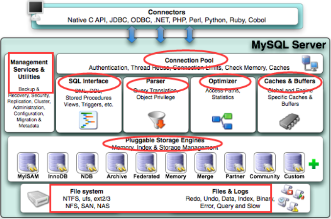
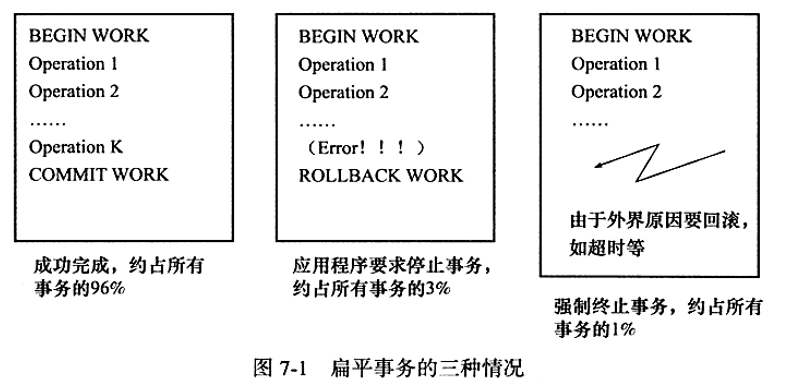
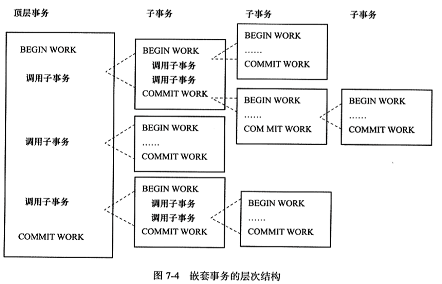
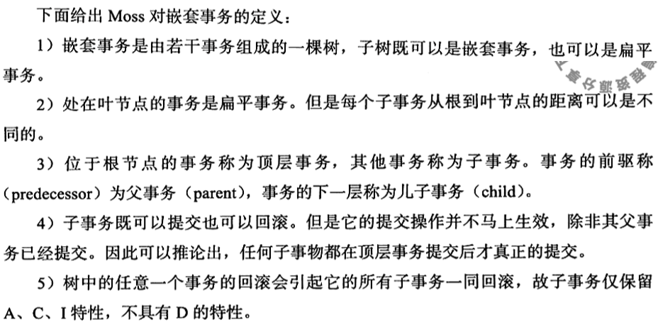

- [1 MySQL 体系结构](#1-mysql-体系结构)
- [2 锁](#2-锁)
    - [2.1 InnoDB 存储引擎中的锁](#21-innodb-存储引擎中的锁)
    - [2.2 锁的算法](#22-锁的算法)
    - [2.3 锁问题](#23-锁问题)
    - [2.4 阻塞](#24-阻塞)
    - [2.5 死锁](#25-死锁)
    - [2.6 锁升级](#26-锁升级)
- [3 事务](#3-事务)
- [4 索引](#4-索引)
    - [4.1 InnoDB 存储引擎支持的常见索引](#41-innodb-存储引擎支持的常见索引)
    - [4.2 B+ 树](#42-b-树)
        - [4.2.1 B+ 树](#421-b-树)
    - [4.3 B+ 树索引](#43-b-树索引)
        - [4.3.1 聚集索引](#431-聚集索引)
        - [4.3.2 辅助索引 (非聚集索引)](#432-辅助索引-非聚集索引)
- [5 数据库基础和SQL语言](#5-数据库基础和sql语言)

# 1 MySQL 体系结构

数据库 database：物理操作系统文件或其他形式文件类型的集合。

实例 instance：MySQL 数据库由后台线程以及一个共享内存区组成。

通常情况下，数据库与实例一一对应。集群的情况下，存在一个数据库对应多个实例。

MySQL 是一个单进程多线程架构的数据库。MySQL 数据库实例在系统上的表现就是一个进程。

MySQL 的组成：

- 连接池组件
- 管理服务和工具组件
- SQL 接口组件
- 查询分析器组件
- 优化器组件
- 缓冲组件 Cache
- **插件式存储引擎**
- 物理文件

存储引擎是基于表的，而不是数据库。




**日志类型：**

1. 二进制日志

   存储数据库中表修改的全部动作，可以用于数据库的主从复制

2. 调试日志

   调试模式下生成的日志

3. 错误日志

   当mysqld启动和停止时，以及服务器在运行过程中发生任何严重错误时的相关信息

4. 查询日志

   记录所有的查询操作

5. 慢查询日志

   记录超时的查询操作，指定时间由 long_query_time 设置

6. 更新日志

   更新日志提供查询信息，但只有修改数据库内容的查询


## 1.1 Innodb存储引擎缓冲池

在 Innodb 中需要用到的数据页都是从缓冲池中分配出来的。

**AWE：**地址窗口化拓展。

**Frame：**帧。16K的虚拟地址空间， 在缓冲池的管理上，整个缓冲区是以大小为16k的 frame 为单位来进行的，frame是innodb中页的大小。

**Page**: 页。16K的物理内存空间， page上存的是需要保存到磁盘上的数据， 这些数据可能是数据记录信息， 也可以是索引信息或其他的元数据等


内存缓冲池：

首先将从磁盘读取到的页放在缓冲池中，这个过程叫做：将页 fix 在缓冲池中。下一次访问时，如果数据在缓冲池中，则该页被命中；若不在，则从磁盘读取页。

修改操作时，先修改缓冲池中的页，然后在定时地更新到磁盘。


缓冲池 中数据页的类型有：

索引页、数据页、undo 页、插入缓冲、自适应哈希索引、InnoDB存储的锁信息、数据字典信息。


MySQL自增的最大值为：2147483647。超出后会报错。


# 2 锁

lock 的对象是事务，用来锁定数据库中的对象。如：表、页、行。一般 lock 的对象仅在事务 commit 或 rollback 后释放。有死锁检测机制。

latch 称为闩锁（轻量级的锁），它要求锁定时间必须非常短，否则性能会很差。latch 分为 mutex (互斥锁) 和 rwlock (读写锁)。没有死锁检测机制。


## 2.1 InnoDB 存储引擎中的锁

- 共享锁 (S Lock)：允许事务读一行数据。
- 排它锁 (X Lock)：允许事务删除或更新一行数据。

X 锁与任何锁都不兼容，S 锁之间兼容。S 和 X 都是行锁。 


- 意向共享锁 (IS Lock)：事务想要获得一张表中某几行的共享锁。
- 意向排它锁 (IX Lock)：事务想要获得一张表中某几行的排它锁 。

意向锁之间相互兼容，IS 与 S 兼容


**一致性非锁定读**

如果读取的行正在被修改或删除， InnoDB 存储引擎回去读取行的一个之前版本的快照数据（undo段）。

- Read Committed 事务隔离级别：总是读取行的最新版本。
- Repeatable Read  事务隔离级别：总是读取事务开始时的版本。

**一致性锁定读**

- select ... for update：加 X 锁，其他事务不能对该行加任何锁。
- select ... lock in share mode：加 S 锁，其他事务只能加 S 锁，加 X 锁会被阻塞。

**自增长与锁**

AUTO-INC Locking 锁是一种特殊的表锁，锁是在完成了自增长值的插入后被释放。

**外键和锁**

对于一个外键列，如果没有显示的给这个列加索引，InnoDB 引擎会自动加一个索引。这样做可以避免表锁。

## 2.2 锁的算法

**行锁的三种算法**

- Record Lock：单个行记录上的锁。
- Gap Lock：间隙锁，锁定一个范围，但不包括当前行。
- Next-Key Lock： Record Lock + Gap Lock，锁定一个范围，包括当前行。

显示地关闭 Gap Lock:

1. 将事务的隔离级别设置为 Read Committed 
2. 将参数 innodb_locks_unsafe_for_binlog 设置为 1

**Phantom Problem 幻想问题**

Phantom Problem 是指在同一事务中，连续执行两次同样的 SQL 语句可能导致不同的结果，第二次的 SQL 语句可能会返回之前不存在的行。

## 2.3 锁问题

**脏读**

脏数据：事务对缓冲池中行记录的修改，还没有被提交。

脏读：在不同事务下，当前事务可以读取到另一个事务未提交的数据。发生在事务隔离级别为 Read Uncommitted 时。

**不可重复读**

在一个事务中，两次相同的操作所读取到的数据不一样。发生在事务隔离级别为 Read Committed 时。

**丢失更新**

一个事务的更新操作会被另一个事务的更新操作覆盖掉。

## 2.4 阻塞

阻塞：有时一个事务的锁需要等待另一个事务的锁释放它所占用的资源。

InnoDB 存储引擎中参数 innodb_lock_wait_timeout 用来控制等待时间（默认 50 秒）；参数 innodb_rollbck_on_timeout 用来设定是否在 等待超时时对进行中的事务进行回滚操作（默认 OFF 不回滚）。

innodb_lock_wait_timeout 是动态的，可以在数据库运行时调整；innodb_rollbck_on_timeout 是静态的，不可以在启动是修改。

必须在事务抛出异常时，进行 commit 或者 rollback，否则会十分危险。

## 2.5 死锁

死锁：两个或者两个以上的事务在执行过程中，因为争夺锁而造成的一种相互等待的现象。若无外力作用，事务将无法推进下去。

线程死锁：两个或者两个以上的线程相互等待对方无法释放的资源，这种等待在无外力的作用下不可接触。

解决死锁：

1. 超时法：当等待时间超过某个值时，一个事务回滚，另一个事务继续执行。

2. 等待图法 wait-for graph：

   数据库需要保存以下两种信息：

   - 锁的信息链表

   - 事务等待链表

   通过上述链表可以构成一张图，若图中存在回路，就代表存在死锁。

## 2.6 锁升级

将多个粒度较小的锁升级为粒度更大的锁。


InnoDB 存储引擎不存在锁升级的问题。


# 3 事务

事务是区别数据库和文件系统的重要特性之一。

事务会把数据库从一种一致状态转换为另一种一致状态。在数据库提交工作时，可以确保要么所有修改都已经保存了，要么所有修改都不保存。

InnoDB 存储引擎中的事务符合：

- 原子性：整个事务是不可分割的工作单位。要么都完成，要么都不完成。
- 一致性：事务将数据库从一种一致状态转变为另一种一致状态。
- 隔离性 (并发控制、可串行化、锁)：一个事务提交之前对其他事务是不可见的。
- 持久性：事务一旦提交，其结果是永久性的。持久性保证事务系统的高可靠性。

事务是由一条或者一组 SQL 语句组成的，事务是访问并更新数据库中各种数据项的一个程序执行单元。

**事务的分类**：

- 扁平事务

  在扁平事务中，所有的操作都处于一个层次，由 begin work 开始，commit work 或者 rollback work 结束，期间操作是原子的，要么都执行，要么都回滚。

  

- 带有保存点的扁平事务

  支持扁平事务的一切操作，还新加了保存点，允许事务回滚到保存点。保存点用 save work 函数来创建。

- 链事务

  在提交一个事务时，释放不需要的数据对象，将必要的处理上下文隐式地传给下一个要开始的事务（提交事务和开始下一个事务 合并为一个原子操作）。

  

- 嵌套事务

  由一个顶层事务控制着各个层次的事务。

  

  

- 分布式事务

  通常是在一个分布式环境下允许的扁平事务，需要根据数据所在位置访问网络中 的不同节点。


**事务隔离级别**

未提交读 Read uncommitted：如果一个事务读取到了另一个未提交的事务修改过的数据。

已提交读 Read committed：一个事务能读到另一个已经提交的事务修改过的数据。

可重复读 Repeatable read：一个事务只会读取该事务开始时的记录快照版本。

串行化 serializable：不允许 读-写、写-读 的并发操作。

 Read committed 每次读取数据前都生成一个ReadView

 Repeatable read 在第一次读取数据时生成一个ReadView


**redo log 与 undo log**

redo log：重做日志，用来实现事务的持久性。该日志文件由 重做日志缓冲(redo log buffer) 和 重做日志(redo log)组成，前者存在内存中，后者存在磁盘中。当事务提交之后会把所有修改信息都会存到该日志中。

- 特点 mysql 为了提升性能不会把每次的修改都实时同步到磁盘，而是会先存到Buffer Pool(缓冲池)里头，把这个当作缓存来用。然后使用后台线程去做缓冲池和磁盘之间的同步。
- 问题 引入了redo log来记录已成功提交事务的修改信息，并且会把redo log持久化到磁盘，系统重启之后在读取redo log恢复最新数据。
- 作用 redo log是用来恢复数据的 用于保障已提交事务的持久化特性。

undo log：回滚日志，用于记录数据被修改前的信息。他正好跟前面所说的重做日志所记录的相反，重做日志记录数据被修改后的信息。undo log主要记录的是数据的逻辑变化，为了在发生错误时回滚之前的操作，需要将之前的操作都记录下来，然后在发生错误时才可以回滚。

- 特点 每次写入数据或者修改数据之前都会把修改前的信息记录到 undo log。
- 问题 undo log 记录事务修改之前版本的数据信息，因此假如由于系统错误或者rollback操作而回滚的话可以根据undo log的信息来进行回滚到没被修改前的状态。
- 作用 undo log是用来回滚数据的用于保障未提交事务的原子性

# 4 索引

索引的优点：

1. 索引大大减少了服务器需要扫描的数据量
2. 索引可以帮助服务器避免排序和临时表
3. 索引可以将随机 I/O 变为顺序 I/O

## 4.1 InnoDB 存储引擎支持的常见索引

- B+ 树索引
- 全文索引
- 哈希索引

哈希索引是自适应的，InnoDB 会根据需要添加，不能人为干预。

## 4.2 B+ 树

**二分查找法**

将一组数据先升序排序，然后每次比较中点位置的值；若大于则在右半区间查找，否则在左半区间查找。

**二叉查找树**

- 二叉查找树中，左孩子的值总是小于父亲的值，右孩子的值总是大于父亲的值。

二叉查找树可能会不平衡，变成链表。

**平衡二叉树**

- 符合二叉查找树
- 必须满足任何节点的两个子树的高度之差小于等于1

维护一棵平衡二叉树，需要经常性的旋转操作，开销较大。

### 4.2.1 B+ 树

由 B 树和索引顺序访问方法 (ISAM) 演化而来。

最下面一层用于存放数，叫做 Leaf Page；上面几层存放索引，叫做 Index Page。 Leaf Page 之间通过双向链表连接起来。


**插入操作：**平衡扩张

1. Leaf 未满，Index 未满：

   直接将记录插入到叶子节点的相应位置中。

2. Leaf 满了，Index 未满：

   需要拆分 Leaf Page。将目标页的中间节点放入 Index 中。小于中间节点的放左边 Page；大于等于的放入右边 Page。

3. Leaf 满了，Index 满了：

   需要拆分 Leaf Page 和 Index Page。先按 2 操作，然后再防止 中间节点。将Index Page 的中间节点放入上一层的 Index Page。小于中间节点的放左边 Page；大于等于的放入右边 Page。


201页，edge的框上输入。

**旋转操作：**

当前Leaf Page满了，而其**左右**兄弟 Leaf Page 未满时，进行旋转操作。

将记录移动到其兄弟节点上，并重新更新 Index Page。

**删除操作：**

使用填充因子来控制删除操作，填充因子最小值是 50%。

填充因子 = 有数的节点数目 / 总节点数目。

1. Leaf 不小于 填充因子，Index 不小于 填充因子

   1.1 要删除的数据不是第一个，直接删除

   1.2 要删除的数据是第一个，删除后，更新 Index Page

2. ...... 没看懂


204页，edge的框上输入。

## 4.3 B+ 树索引

在数据库中 B+ 树的高度一般在 2 — 4 层。

### 4.3.1 聚集索引

聚集索引就是按照每张表的主键构造一棵 B+ 树，叶子节点中存放的是整张表的行记录数据。也将聚集索引的叶子节点叫做数据页。

每张表只有一个聚集索引。聚集索引并不是物理上连续的，而是逻辑上连续的。

**优点**

1. 减少磁盘IO
2. 数据访问更快
3. 使用覆盖索引扫描的查询可以直接使用页节点中的主键值
4. 对于主键的范围查找和排序查找速度非常快。

**缺点**

1. 插入速度依赖与插入顺序
2. 更新索引的代价很高
3. 页分裂问题
4. 二级索引变大，因为与主索引有关
5. 二级索引查找的次数不只一次

### 4.3.2 辅助索引 (非聚集索引)

辅助索引的叶子节点不包括行记录的全部数据，包含一个键值和书签。

当使用辅助索引来查询数据时，会先通过辅助索引找到指向聚集索引的主键，然后再通过聚集索引来找到完整的记录。


覆盖索引：最左原则：


# 5 数据库基础和SQL语言

**数据库**是保存有组织的数据的容器（通常是一个或者一组文件）。

**表**是某种特定类型数据的结构化清单。

**模式**是关于数据库和表的布局及特性的信息。

**列**是表中的一个字段。所有的表都是由一个或多个列组成的。

**数据类型**：所容许的数据的类型。每个表的每一列都有相应的数据类型。

**行**是表中的一个记录。

**主键**是一个或者一组列，它能够唯一地区分表中的每一行。

​	任意两行不能具有相同的主键值；

​	每一行都要有一个主键值。


**SQL 的优点：**

1. 几乎所有重要的 DBMS 都支持 SQL；
2. SQL 简单易学；
3. SQL 是强有力的语言，灵活使用可以进行非常复杂和高级的数据库操作。

**MySQL 的优点：**

1. 开源免费
2. 性能好，执行非常快
3. 可信赖
4. 简单，安装和使用都很容易


**候选码：** 若关系中的某一属性组的值能唯一地标识一个元组，而其子集不能，则称该属性组为候选码。

**主码：**若一个关系中有多个候选码，则选定其中一个为主码。

**主属性：** 所有候选码的属性称为主属性。

**非主属性：**不包含在任何候选码中的属性称为非主属性。

数据库六大范式

- 第一范式：每个列都不可以再拆分。
- 第二范式：在第一范式的基础上，非主属性必须完全依赖于候选码（消除非主属性对主属性的部分依赖）
- 第三范式：在第二范式的基础上，任何非主属性不依赖于其它非主属性（消除传递依赖）
- BC 范式：在第三范式的基础上，任何主属性不能对候选码子集依赖（消除主属性对于候选码的部分与传递函数依赖）
- 第四范式：在BC范式的基础上，限制关系模式的属性之间不允许有非平凡且非函数依赖的多值依赖。
- 第五范式：在第四范式的基础上，表必须可以分解为较小的表，除非那些表在逻辑上拥有与原始表相同的主键。


## 5.1 Show 命令

登录 mysql：

```
mysql -u root -p
```

查看数据库：

```sql
show databases;
```

使用某个数据库

```sql
use creshcourse;
```

查看数据库中的表

```sql
show tables;
```

查看某张表的列

```sql
show columns from customers;
```


## 5.2 检索数据

**select：查询表中的一些列**

```sql
select user_name from t_user;
select user_name, user_sex from t_user;
select * from t_user;
```

**distinct：去除重复数据**

```sql
select distinct user_name from t_user;
```

**limit：限制返回前几行数据**

```sql
-- 返回前 5 行数据
select user_name from t_user limit 5;
select user_name from t_user limit 0, 5;
-- 从行号 2 开始后面 5 行数据 （行数是 从 0 开始数的）
select user_name from t_user limit 2, 5;
```

当行数不够时，只会返回已有的那么多行；当行号越界时，返回 零行数据

**完全限定的表名**

```sql
select user_name from mybatis.t_user;
```

当没有执行 use mybatis时，可以使用完全限定的表名。


**order by 子句**

```sql
select user_id, user_name from t_user order by user_name;
select * from t_user order by user_name, user_email;
```

order by 子句取一个或多个列来对输出进行排序。

```sql
select * from t_user order by user_id asc;
select * from t_user order by user_id desc;
select * from t_user order by user_name desc, user_id;
select * from t_user order by user_name, user_id desc;
select * from t_user order by user_name desc, user_id desc;
```

desc：降序；asc：升序，默认

desc 只作用于其前面的一列。

【寻找一列中最高或最低的值】

```sql
select * from t_user order by user_id desc limit 0, 1;
```

